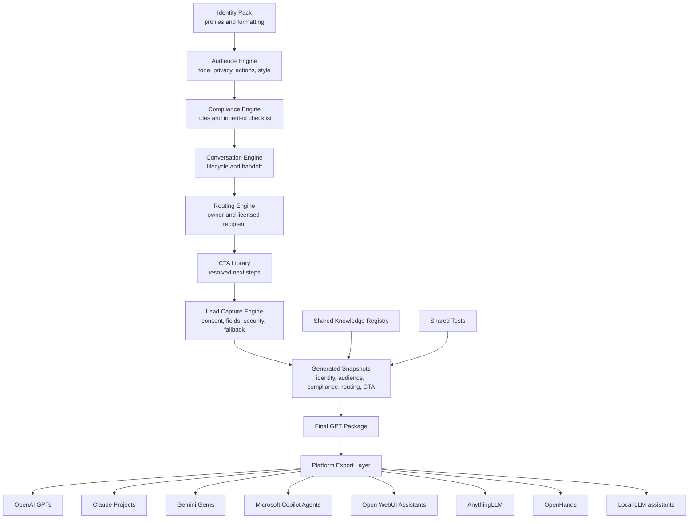

# Core module dependency map

The builder composes every future assistant through one ordered graph. Arrows mean “resolves before and constrains.” Package purpose may narrow the result but cannot override upstream identity, safety, privacy, compliance, routing, or consent.

## Dependency contract

1. `config/profiles/` contains approved person-specific identity values.
2. `core/` contains all shared behavior and formatting.
3. A blueprint selects owner, audience, knowledge, capabilities, Actions, routing, compliance level, and target platform.
4. `scripts/build_gpt_package.rb` validates cross-field constraints and resolves inherited modules.
5. Generated package files include `generated/factory_dependencies.yaml`, with a SHA-256 digest for every core module and selected profile.
6. Any shared source change produces a different build fingerprint and must regenerate affected packages.
7. `exporters/` changes platform packaging only; it cannot change core behavior.
