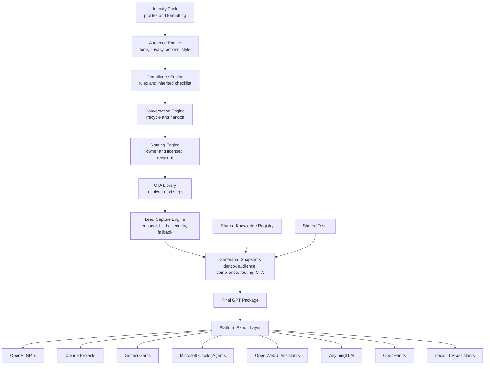

# Legends Custom GPT Factory

A reusable system for creating branded, compliant, maintainable Custom GPTs for Jeremy McDonald, The Legends Mortgage Team, loan officers, Realtor partners, consumers, and future business units.

## Current release

| Field | Value |
| --- | --- |
| Version | `1.0.0` |
| Release date | 2026-07-17 |
| Branch | `main` |
| Repository | [GitHub](https://github.com/jeremymcdonald-prog/legends-customGPTs) |

## Release status

    

## Executive overview

This repository is a governed GPT operating system, not a prompt dump. Approved blueprints inherit centralized identity, audience, compliance, conversation, routing, CTA, lead-capture, knowledge, and test modules; deterministic builders then create auditable, versioned packages for supported assistant platforms.

## Architecture flow



## Repository statistics

| Metric | Current value |
| --- | ---: |
| Core modules | 12 |
| Audience profiles | 9 |
| Compliance topics | 13 |
| CTA variants | 18 |
| Routing tests | 15 |
| Action tests | 15 |
| Platform exports | 8 |
| Planned GPTs | 0 |
| Built GPT packages | 0 |
| Approved GPT packages | 0 |
| Archived source documents | 657 |
| Last generated timestamp (UTC) | 2026-07-17T00:00:00Z |

## Main capabilities

- Centralized identity profiles
- Loan officer and Realtor profile inheritance
- Assigned lending-partner routing
- Audience, Compliance, Conversation, Routing, and CTA engines
- Non-deployed lead-capture architecture
- Deterministic package generation and portfolio rebuild
- Factory, profile, routing, and contract validation
- Multi-platform export configuration
- Governed knowledge-curation model
- Versioned, hash-tracked GPT packages

## Supported owner modes

- Jeremy
- Loan officer
- Realtor
- Team shared

## Supported audiences

- Consumer
- Realtor
- Loan Officer
- Internal Team
- Recruit
- Vendor
- Marketing
- Executive
- Mixed

## Supported export targets

| Platform | Adapter status | Action format |
| --- | --- | --- |
| OpenAI GPTs | `ready_for_manual_upload` | `OpenAPI` |
| Claude Projects | `planned` | `MCP_or_connector` |
| Gemini Gems | `planned` | `platform_specific` |
| Microsoft Copilot Agents | `planned` | `connector_or_flow` |
| Open WebUI Assistants | `planned` | `tool_server` |
| AnythingLLM | `planned` | `agent_flow` |
| OpenHands | `planned` | `tool_configuration` |
| Local LLM assistants | `planned` | `local_tool_gateway` |

## Repository map

| Path | Purpose |
| --- | --- |
| `core/` | Canonical identity, audience, compliance, conversation, routing, Action, CTA, lead-capture, knowledge, test, prompt, and template modules. |
| `config/` | Approved professional profiles and generator configuration. |
| `gpts/` | Authorized blueprints, generated GPT packages, package templates, and planning briefs. |
| `actions/` | Compatibility and export paths for reusable Action contracts. |
| `knowledge/` | Curated, owned, dated knowledge approved for package selection. |
| `scripts/` | Deterministic builders, generators, validators, and tests. |
| `docs/` | Architecture, governance, release, QA, and portfolio documentation. |
| `source_material/` | Immutable research archive excluded from direct GPT inheritance. |

## Quick start

```bash
# Validate the complete Factory
ruby scripts/validate_gpt_factory.rb

# Generate this README
ruby scripts/generate_readme.rb

# Generate one authorized GPT package
ruby scripts/build_gpt_package.rb --blueprint /approved/path/<slug>.yaml --output-root gpts

# Rebuild every registered GPT blueprint
ruby scripts/rebuild_all_gpts.rb

# Run contact/profile snapshot tests
ruby scripts/test_contact_snapshot_generation.rb

# Run the non-deployed lead-capture contract tests
ruby scripts/test_lead_capture_contract.rb
```

## GPT package standard

Every authorized package is generated from the canonical Factory structure:

```text
gpts/<slug>/
  README.md
  manifest.md
  instructions.md
  conversation_starters.md
  changelog.md
  knowledge/
  generated/
  tests/
    factory_acceptance_tests.yaml
    contact_and_referral_routing_tests.md
  actions/
  compliance/
    checklist.md
  examples/
```

See [Architecture](docs/goat_architect/Architecture.md) and the [GPT Factory Build Process](docs/GPT_FACTORY_BUILD_PROCESS.md).

## Contact and referral routing

- Jeremy-owned GPTs route mortgage opportunities to Jeremy's active licensed profile.
- Loan-officer-owned GPTs route to the selected active licensed loan officer.
- Realtor-owned GPTs preserve the Realtor identity while mortgage inquiries and Apply Now behavior route to the assigned licensed lending partner.
- Team-shared GPTs require an approved recipient before mortgage routing is enabled.
- Consumer lead submission identifies the licensed recipient and requires explicit affirmative consent.
- Full mortgage applications use the resolved secure Apply Now URL, never ordinary lead capture.

## Compliance boundary

- No guaranteed approval.
- No guaranteed rate.
- No guaranteed payment.
- No guaranteed savings.
- No guaranteed terms.
- No autonomous underwriting or eligibility decisions.
- No sensitive mortgage application data in ordinary lead capture.
- Public releases require privacy, security, compliance, licensing, and operational approval.

Loan Factory, Inc., NMLS 320841. Jeremy McDonald, NMLS 1195266. Equal Housing Opportunity.

## Current portfolio

### Ranked Top 15

| Rank | GPT recommendation | Score |
| ---: | --- | ---: |
| 1 | Legends Pipeline & Processing Copilot | **136 / 150** |
| 2 | Legends Realtor Co-Marketing & Partner Growth Studio | **134 / 150** |
| 3 | Legends Mortgage Content Repurposing Studio | **134 / 150** |
| 4 | Legends Team Growth & Coaching Assistant | **130 / 150** |
| 5 | Legends Webinar Campaign Builder | **128 / 150** |
| 6 | Legends Executive AI Boardroom | **126 / 150** |
| 7 | Legends Loan Scenario & Structuring Copilot | **123 / 150** |
| 8 | Legends Visual & Video Production Coach | **122 / 150** |
| 9 | Legends Brand Voice & AI Twin Studio | **122 / 150** |
| 10 | Legends Local Search & GBP Growth Assistant | **119 / 150** |
| 11 | Legends Market & Rate Translator | **116 / 150** |
| 12 | Legends Borrower Education & Lead Concierge | **116 / 150** |
| 13 | Legends Investor & DSCR Deal Desk | **115 / 150** |
| 14 | Legends Integrations Setup Coach | **109 / 150** |
| 15 | Legends Podcast & Long-Form Content Producer | **108 / 150** |

### Current first-five portfolio recommendations

These are portfolio recommendations, not an approved build order.

1. Legends Pipeline & Processing Copilot
2. Legends Realtor Co-Marketing & Partner Growth Studio
3. Legends Mortgage Content Repurposing Studio
4. Legends Team Growth & Coaching Assistant
5. Legends Webinar Campaign Builder

## Current build status

No individual GPT package manifests currently exist.

### Planned GPTs

No planned GPT packages.

### Draft GPTs

No draft GPT packages.

### Pilot GPTs

No pilot GPT packages.

### Approved GPTs

No approved GPT packages.

### Deprecated GPTs

No deprecated GPT packages.

### Archived GPTs

No archived GPT packages.

## Release and versioning

The Factory uses semantic versioning (`MAJOR.MINOR.PATCH`). Release history and material changes are recorded in [CHANGELOG.md](CHANGELOG.md). Generated GPT packages maintain their own semantic versions and changelogs.

## Safety and secrets

Credentials, tokens, private keys, live webhooks, borrower data, and hidden environment values never belong in this repository. The visible no-secret environment and credential process is documented in [Credentials Map — No Secrets](docs/goat_architect/Credentials_Map_No_Secrets.md); future environment templates may contain variable names and safe placeholders only.

## Documentation

- [GPT Factory Build Process](docs/GPT_FACTORY_BUILD_PROCESS.md)
- [Architecture](docs/goat_architect/Architecture.md)
- [Product Requirements](docs/goat_architect/PRD.md)
- [Vision](docs/goat_architect/Vision.md)
- [Contact and Referral Routing Standard](docs/CONTACT_AND_REFERRAL_ROUTING_STANDARD.md)
- [Team Member Setup Guide](docs/TEAM_MEMBER_GPT_SETUP_GUIDE.md)
- [Top 15 Report](docs/reports/TOP_15_CUSTOM_GPTS_REPORT.md)
- [Architecture Refactor Plan](docs/reports/ARCHITECTURE_REFACTOR_PLAN.md)
- [Core Module Dependency Map](CORE_MODULE_DEPENDENCY_MAP.md)
- [Lead Capture Action Documentation](core/lead_capture/README.md)
- [QA Log](docs/goat_architect/QA_Log.md)
- [Next Actions](docs/goat_architect/Next_Actions.md)
- [README Generation](docs/README_GENERATION.md)
- [v1.0.0 Release Report](docs/releases/GPT_FACTORY_V1_RELEASE_REPORT.md)

## License status

**undetermined / all rights reserved by default.** See [LICENSE_STATUS.md](LICENSE_STATUS.md). Do not treat this repository as open source or redistribute it unless the owner adds an explicit license that permits that use.

## Maintainer

Jeremy McDonald<br>
LO Development, AI & Marketing Consultant<br>
Team Leader, The Legends Mortgage Team

## Generated file

This README is generated by `scripts/generate_readme.rb` from repository metadata. Do not edit `README.md` directly; update the configured source of truth and regenerate it.
